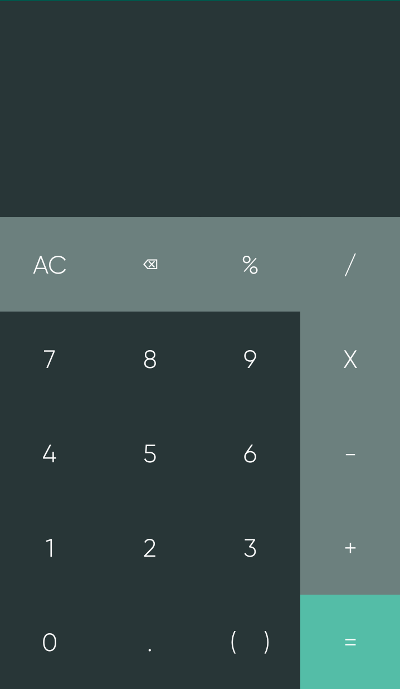
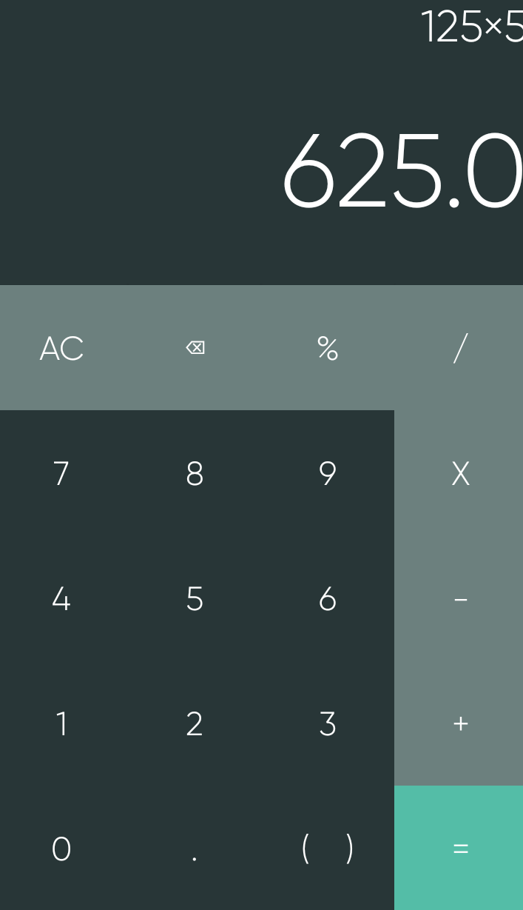

## CALCULATOR 

A simple Android calculator app built with Java.

## INFO

A very simple calculator that I made to acquaint myself with Android Studio. Based on a project I had already done before. Not to be updated beyond a basic level as I will move on to projects I am more interested in.

Supports simple operations such as additon,multiplication,division,subtraction.

## IMAGES 

## LICENSE

MIT License, feel free to use the code as you please
